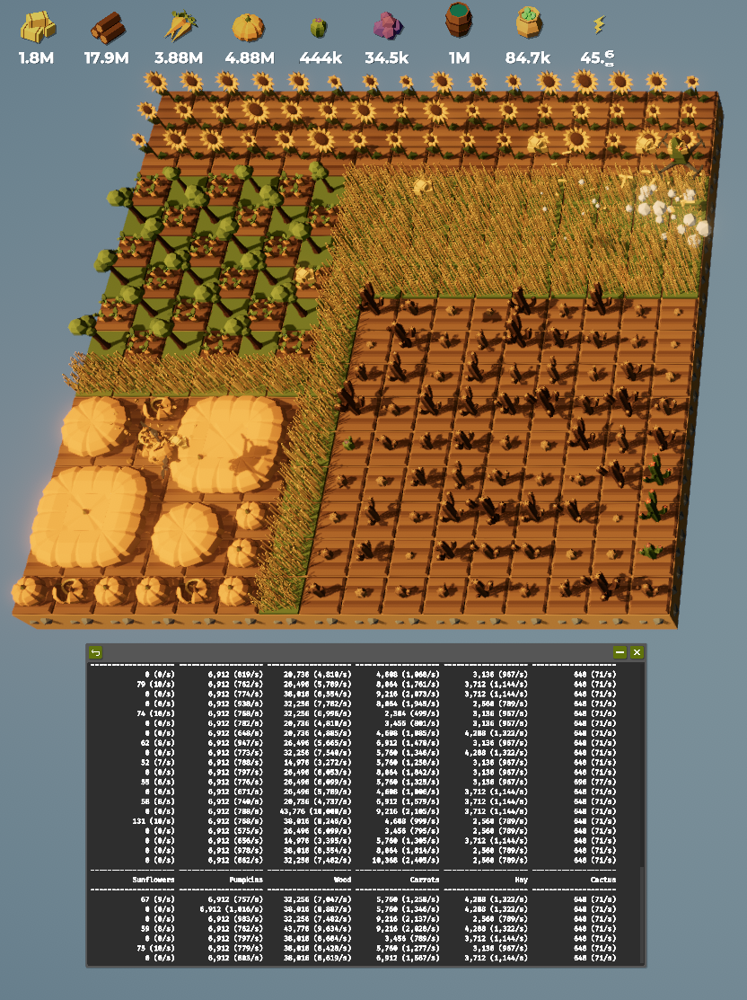

# The Farmer Was Replaced game

This repo is just my personal game files for
[The Farmer Was Replaced](https://store.steampowered.com/app/2060160/The_Farmer_Was_Replaced/).

Note that it is *similar* to Python but is actually a subset of the language implemented by the game developer.

# Helper modules

| name | description |
|---|---|
| grid | Dealing with 2-d coordinates, and traversing the grid |
| stats | Displaying productions stats |

# Screenshots

git st